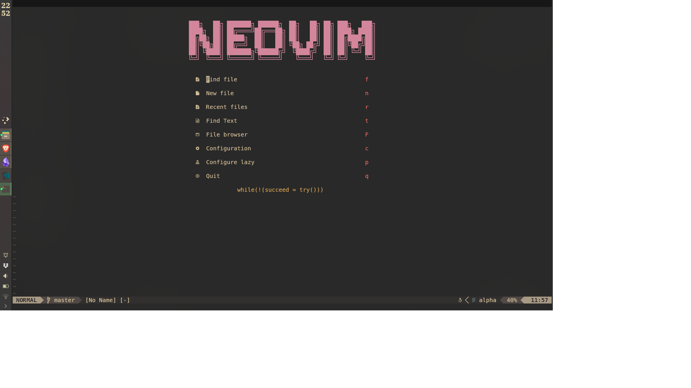
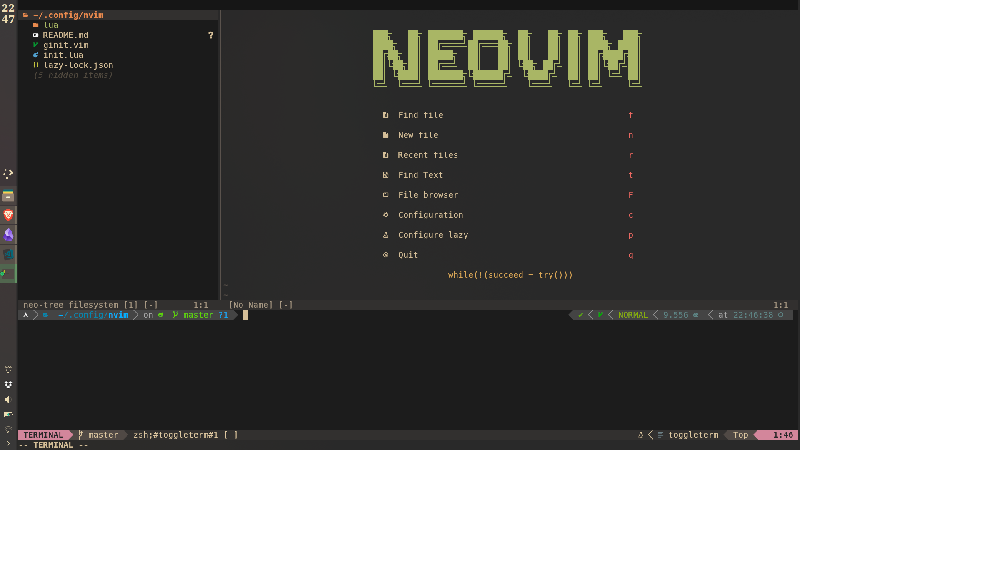
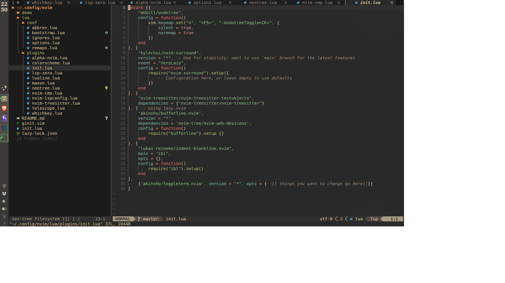

# [nvim-config](https://github.com/ananthvk/nvim-config)
These are my dotfiles for neovim written in pure Lua.
My dotfiles for vim/neovim in vimscript is [here](https://github.com/ananthvk/vim-config)

## Features
* Uses [lazy.nvim](https://github.com/folke/lazy.nvim) as package manager
* Colorscheme [gruvbox-material](https://github.com/sainnhe/gruvbox-material)
* LSP and treesitter are installed and configured.
* Has a dashboard, terminal and file explorer.

## Installation
### Linux
If you have already configured neovim, backup your `~/.config/nvim` folder before continuing.
```
cd ~/.config
```
Delete the nvim folder(if it exists).
```
git clone https://github.com/ananthvk/nvim-config nvim
```
Run neovim
### Windows
Find the location of your neovim config folder, usually in `~/AppData/Local/nvim` and backup the folder.
```
cd ~/AppData/Local
```
Delete the nvim folder(if it exists), and clone or copy the files to in this repo to `nvim` folder.
```
git clone https://github.com/ananthvk/nvim-config nvim
```
You may need to install MinGW and place it on `PATH` for LSP to work.

## Screenshots



